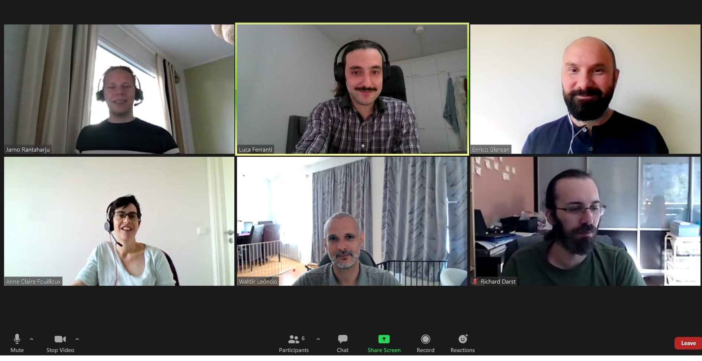

+++
+++

# Nordic-RSE meetings

## Virtual coffee break (weekly)

- **9:00 Europe/Stockholm (10:00 Europe/Helsinki) every Thursday**
  ([convert to your time zone](https://arewemeetingyet.com/Helsinki/2021-09-02/10:00/w)).
- [Zoom link](https://aalto.zoom.us/j/62426845282) (Zoom ID 624 2684 5282).

The coffee break is an informal meeting, open for everyone to discuss with and listen to
others interested in research software engineering.

## Community discussions (every second week)

- **13:00 Europe/Stockholm (14:00 Europe/Helsinki) every second Thursday**
  ([convert to your time zone](https://arewemeetingyet.com/Helsinki/2021-09-02/14:00/w)).
- [Zoom link](https://aalto.zoom.us/j/62426845282) (Zoom ID 624 2684 5282).
- [Notes](https://hackmd.io/@nordic-rse/biweekly)

During our biweekly community meeting we discuss what we, as Nordic-RSE can do
to get RSE and RSE-minded people together to discuss the topics that interest
us.  RSE in the Nordics is not well known (yet), so a big part of discussions
are also around how we can make it more known. There is no requirement to join
the meetings, other than an interest in what we are doing.  Anyone is very
welcome to provide some of their time to advance these goals, be it minutes or
days. 

## [Nordic-RSE conference 2025](https://nordic-rse.org/nrse2025/) planning (every second week)

- Alternating with community discussion meetings.
- **13:00 Europe/Stockholm (14:00 Europe/Helsinki) every second Thursday**
  ([convert to your time zone](https://arewemeetingyet.com/Helsinki/2021-09-02/14:00/w)).
- [Zoom link](https://aalto.zoom.us/j/62426845282) (Zoom ID 624 2684 5282).
- [Notes](https://hackmd.io/@nordic-rse/biweekly)

## Board meeting (when needed)

The board of the association meets when required. The board handles necessary
official actions, paperwork and budgeting. The board also officially represents
the association.

## Association meeting (yearly)

Once every year all members of the Nordic-RSE association are invited to the
annual meeting. The annual meeting chooses the board and other officials, and
decides the annual membership fee. The annual meeting may also decide other
matters, but these will be introduced in the invitation.
